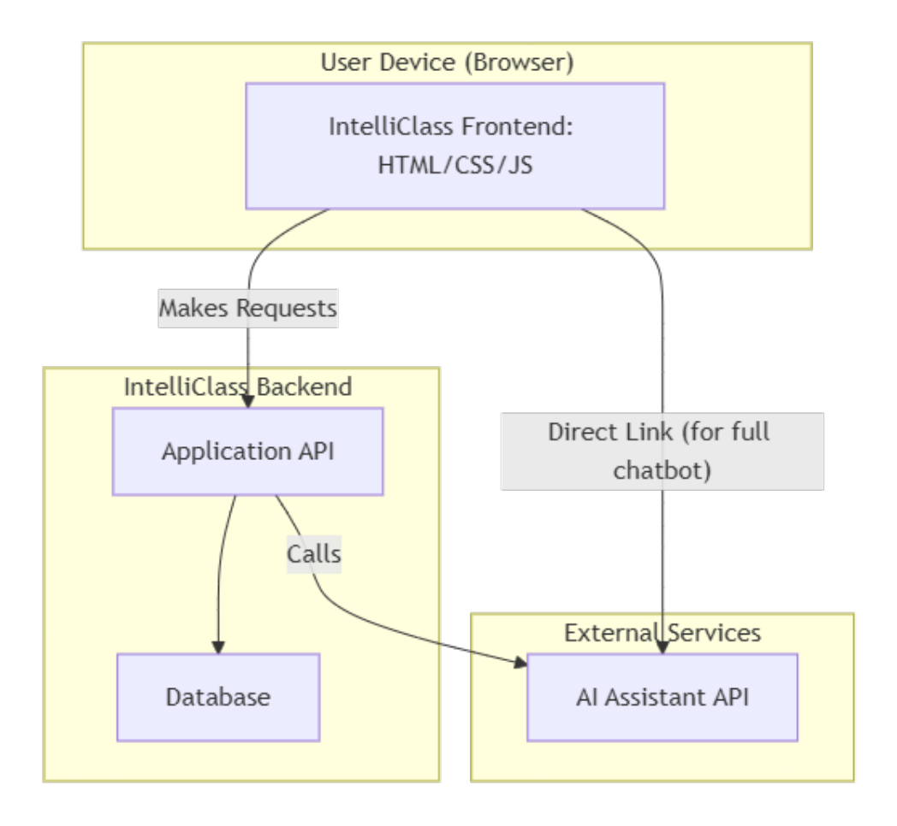
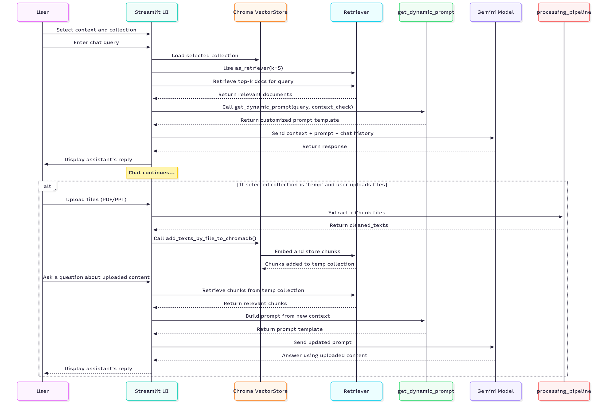
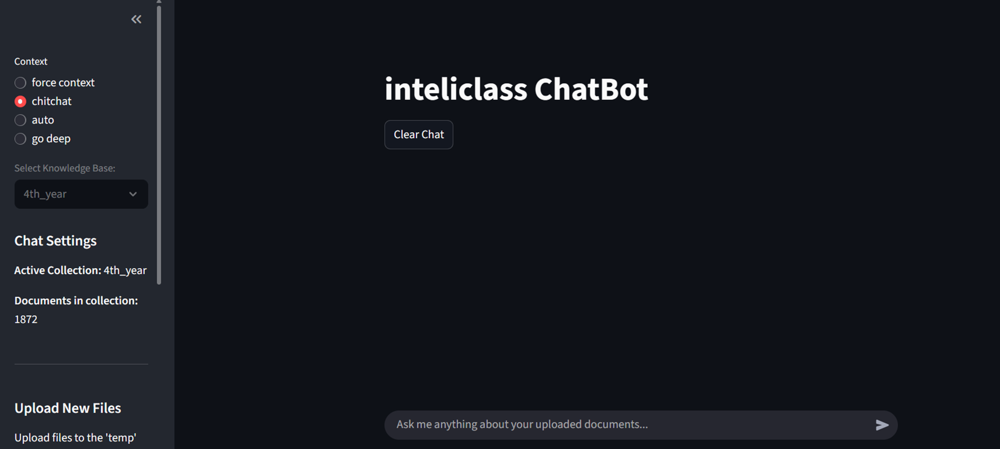
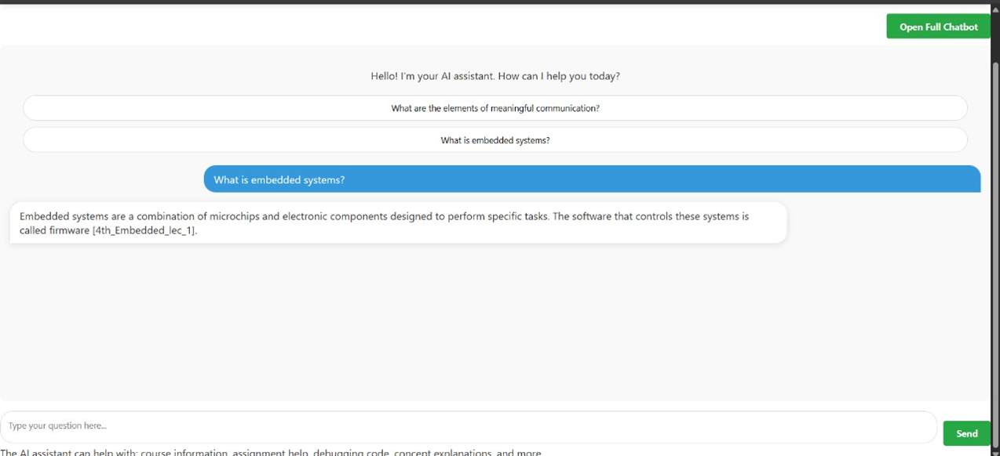
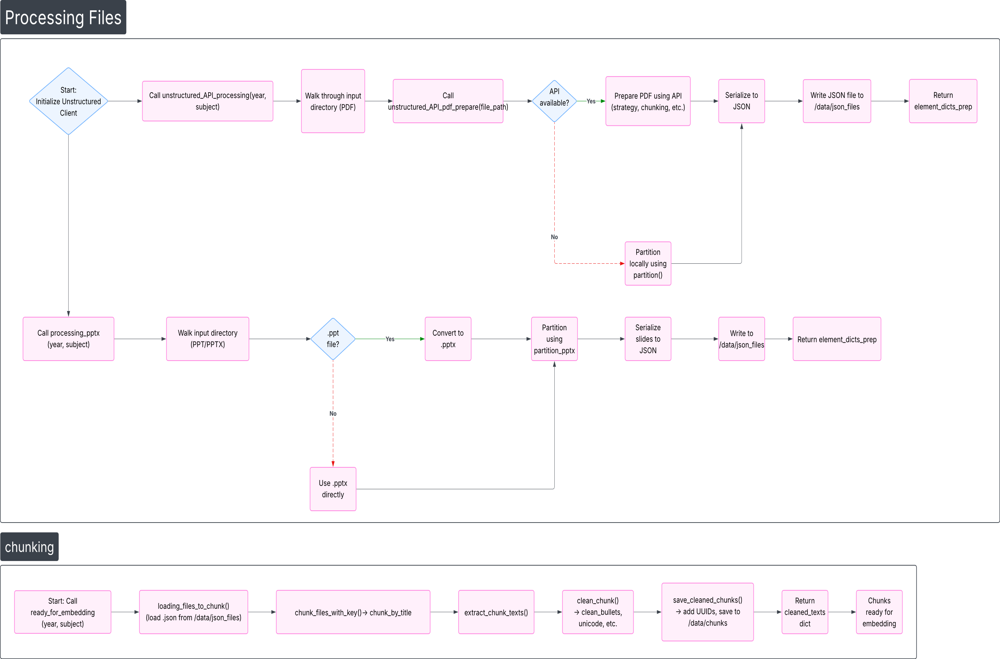
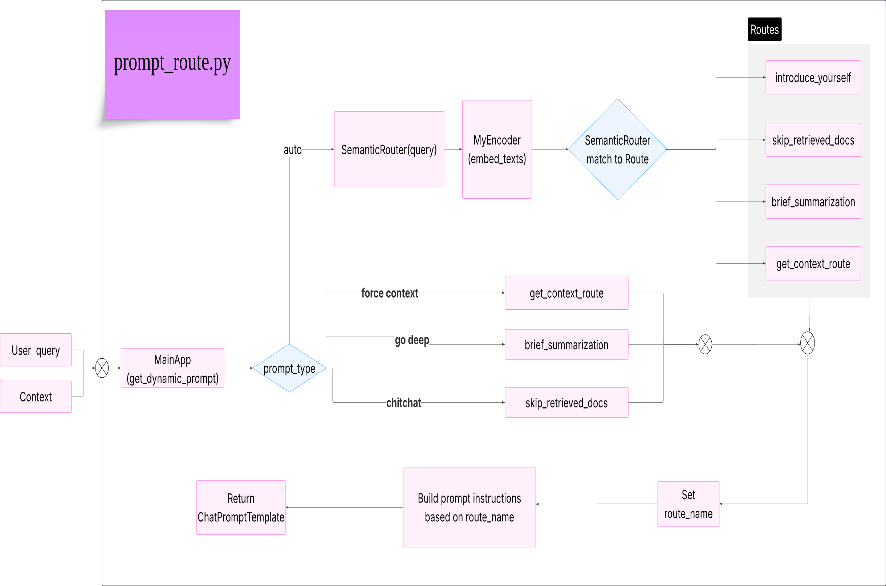
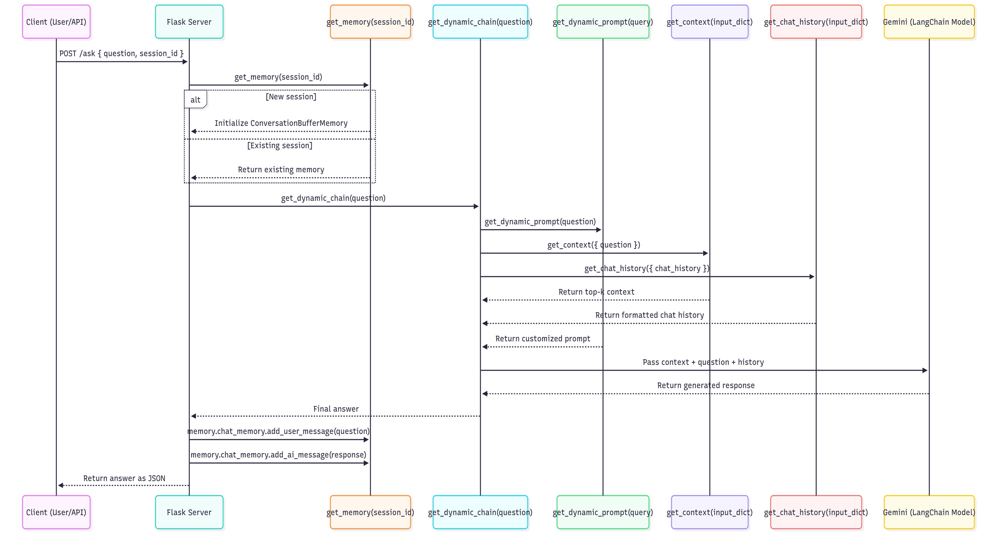
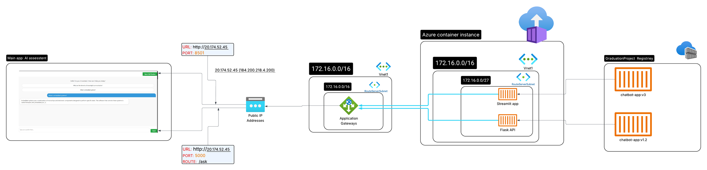

# Detailed Project Documentation: inteliclass ChatBot

## 1. Project Overview

`inteliclass ChatBot` is a Streamlit application for answering questions over lecture materials. The repository combines four main pieces:

- a user-facing chat app in Streamlit,
- a preprocessing pipeline that converts uploaded PDFs and PowerPoints into cleaned text chunks,
- a persistent ChromaDB vector store for retrieval,
- a Google Gemini chat model that generates the final answer.

The app is designed around course materials. It currently exposes two knowledge bases in the UI: `temp` for newly uploaded files and `4th_year` for the persistent course collection.

### High-Level Component Architecture



The system consists of three main layers:
- **Frontend**: IntelliClass UI accessed via browser (HTML/CSS/JS)
- **Backend**: Application API that orchestrates retrieval, routing, and LLM calls
- **Services**: ChromaDB for storage, Google Gemini API for intelligence, and optional Unstructured API for document parsing

## 2. High-Level Architecture & Runtime Flow

The runtime flow is:

1. The user opens the Streamlit app.
2. The app loads the local embedding model and the Google Gemini chat model.
3. The user selects a collection and asks a question.
4. The app retrieves the most relevant chunks from ChromaDB.
5. A prompt is assembled using the selected routing mode and the chat history.
6. Gemini generates the answer.
7. If the user uploads files, the preprocessing pipeline converts them into chunk JSON files and then inserts them into the `temp` collection.

The main source files are:

- `src/st_app.py` for the chat UI and runtime logic.
- `src/data_preprocessing.py` for file extraction, cleaning, chunking, and saving.
- `src/pushing_to_vdb.py` for embedding and ChromaDB writes.
- `src/model_loading.py` for loading the local E5 model.
- `src/prompot_router.py` for semantic routing and prompt selection.

### Streamlit Application Flow

The complete sequence of interactions in the Streamlit-based chatbot:



This diagram shows:
- **Query Flow** (top): User input → collection selection → retrieval → prompt generation → Gemini response
- **Upload Flow** (bottom): File upload → processing pipeline → embedding → ChromaDB ingestion
- **Key Components**: Chroma VectorStore, Retriever, Prompt Router, and Gemini Model interactions
- **Feedback Loop**: How responses are stored and used for context in follow-up questions

## 3. Startup Flow

The Streamlit entrypoint is `src/st_app.py`.

At startup, the app:

- applies custom sidebar styling,
- opens or creates the ChromaDB collections `temp` and `4th_year`,
- loads environment variables from `.env`,
- reads `GOOGLE_API_KEY` and `MODEL_NAME`,
- initializes session state for chat messages and the selected collection,
- loads the Google Generative AI chat model,
- creates a Chroma retriever for the selected collection.

If `GOOGLE_API_KEY` is missing, the app stops immediately.

The container startup defined in `Dockerfile_org` runs:

```bash
streamlit run src/st_app.py --server.port=8501 --server.address=0.0.0.0
```

The simpler `Dockerfile` only sets the base image, working directory, and copies `src/`, so it does not by itself define the runtime command.

## 3.1 User Interface Overview

### Main Chat Interface



The main interface consists of:
- **Sidebar (Left)**: Context mode selector (force context / chitchat / auto / go deep), knowledge base dropdown, chat settings, and file upload
- **Main Area (Center)**: Chat title, Clear Chat button, conversation history, and input prompt
- **Chat Settings**: Shows active collection and document count
- **Upload Section**: Appears when temp collection is selected, allowing PDF/PPT/PPTX uploads

### Real Chat Example



Shows a live conversation example where the user asks "What is embedded systems?" and the chatbot retrieves the answer from the lecture materials with proper citation.

## 4. Chat Behavior

The user can choose one of four routing modes in the sidebar:

- `force context`
- `chitchat`
- `auto`
- `go deep`

The selected mode controls how the prompt is built:

- `force context` forces retrieval-based answering.
- `chitchat` skips retrieved documents.
- `auto` lets the semantic router choose the route.
- `go deep` uses the brief summarization route.

The chat history is stored in `st.session_state.messages`. When the collection changes, the app clears the stored messages so answers do not mix across collections.

The answer generation chain combines:

- retrieved context from Chroma,
- the current question,
- formatted chat history,
- a dynamically selected prompt,
- the Gemini model,
- and a string output parser.

## 5. Retrieval and Vector Store

The vector store is backed by persistent ChromaDB at `chroma_db/`.

The embedding function is a custom wrapper around the local E5 model loaded in `src/model_loading.py`.

The embedding behavior is:

- texts are prefixed with `passage:` before embedding,
- queries are prefixed with `query:` unless they already have a prefix,
- embeddings are generated locally with `transformers`, not by an external embedding API,
- mean pooling is used over the token embeddings.

Each Chroma collection stores document text, ids, and metadata. The code currently uses a `source_file` metadata field, plus chunk index and year where available.

For retrieval, the app uses `k=5` nearest chunks and formats them into a context string that includes the source file name and chunk content.

### Vector Database Management


The diagram illustrates:
- **Runtime** (`st_app.py`): User uploads trigger the processing pipeline, which saves chunks and calls `add_texts_by_file_to_chromadb()`
- **Local** (`pushing_to_vdb.py`): Collections for 4th_year, 3rd_year, 2nd_year, 1st_year, and temp are created or updated
- **End Session Button**: Clears the temp collection and empties all documents via `temp_collection.delete(ids=all_ids)`
- **Collections Structure**: Multi-year organization with centralized embeddings and metadata tracking

## 6. Ingestion Pipeline

Uploaded files are handled by `src/data_preprocessing.py`.

The upload pipeline accepts:

- `.pdf`
- `.ppt`
- `.pptx`

### Processing Pipeline Flowchart

The complete file processing and chunking workflow:



The high-level processing steps are:

1. Upload the raw file to a temporary folder under `data/temp/user_files`.
2. Process PDFs with Unstructured (either API-based or local partitioning).
3. Process PowerPoint files with `partition_pptx`.
4. Convert the extracted JSON into elements.
5. Chunk the elements with title-based chunking.
6. Clean the chunks (remove unicode artifacts, bullets, etc.).
7. Save the cleaned chunks as JSON under a temp chunks folder.
8. Add those chunks to ChromaDB.

The key pipeline function is `processing_pipeline(uploaded_files, ...)`, which returns a structure containing PDF results, PowerPoint results, and cleaned texts.

### 6.1 PDF Processing

PDFs are handled by `unstructured_API_pdf_prepare()` and `unstructured_API_processing()`.

If `UNSTRUCT_API_KEY` and `UNSTRUCT_API_URL` are available, the code tries the Unstructured API client first. If that fails, it falls back to local partitioning.

### 6.2 PowerPoint Processing

PowerPoint files are handled by `processing_pptx()`.

If the upload is a legacy `.ppt`, the code copies it to a `.pptx` path before partitioning. Temporary files starting with `~$` are skipped.

### 6.3 Chunking and Cleaning

After JSON extraction, the code:

- converts JSON into Unstructured elements,
- chunks by title with smaller chunk sizes for retrieval,
- converts chunks into text,
- cleans Unicode quotes, byte-string artifacts, bullets, and excess whitespace,
- drops very short chunks.

Cleaned chunks are then written into JSON files with UUID-based ids so they can be inserted into ChromaDB.

## 7. Data Storage Layout

The repository contains several important data locations:

- `data/raw/` for source lecture files,
- `data/json_files/` for extracted JSON representations,
- `data/chunks/` for cleaned embedding chunks,
- `data/temp/` for user uploads and temporary pipeline output,
- `chroma_db/` for the persistent vector database.

The repository also contains a `data/chunks/` set of prebuilt lecture chunk files. These are used as the existing knowledge base for persistent collections.

The UI only uploads to the `temp` collection. The `4th_year` collection appears to be the persistent course collection used for retrieval.

## 8. Prompt Routing

Prompt routing lives in `src/prompot_router.py`.

The router defines four semantic routes:

- `skip_retrieved_docs`
- `brief_summarization`
- `introduce_yourself`
- `get_context_route`

The route is chosen with a semantic router backed by the local embedding model.

### Prompt Routing Logic



The diagram shows:
- **Input**: User query and context selection mode
- **Routing Decision**: SemanticRouter matches user query to one of four routes
- **Route Outputs**: Each route selects a specific prompt template (introduce_yourself, skip_retrieved_docs, brief_summarization, or get_context_route)
- **Sidebar Overrides**: The `prompt_type` selector (force context, chitchat, auto, go deep) can override automatic routing
- **Output**: ChatPromptTemplate that combines context, chat history, and instruction

The prompt builder can also override the route based on the sidebar mode. That means the same question can behave differently depending on whether the user chooses context-only, chitchat, automatic routing, or deep summarization.

For introductions and chitchat, the prompt includes a list of available year/subject pairs discovered from `data/chunks/*.json`.

For context mode, the prompt instructs the model to include citations in `[filename]` format.

## 9. User Interface and Session State

The Streamlit UI has three main areas:

- the main chat panel,
- a context and collection selector in the sidebar,
- a file upload and session cleanup area in the sidebar.

### Session State Management


The session lifecycle includes:
- **Initialization**: `st.session_state` is set up with empty messages and default collection
- **Main Loop**: User types → message is appended → processing query → building context and chat history → calling LLM → appending response
- **Collection Switch**: Changing the selected collection triggers chat history clear
- **Clear Chat**: User can clear visible conversation without affecting database
- **End Session**: Pressing the end session button deletes all temp collection documents and resets all session state

Important behavior:

- switching collections clears the chat history,
- `Clear Chat` clears only the visible conversation,
- `End Session & Empty Temp Collection` deletes all documents from the `temp` collection and clears Streamlit session state,
- collection counts are displayed in the sidebar when available.

File uploads are only enabled when the selected collection is `temp`. The app tells the user to switch to `temp` before uploading new files.

## 10. Configuration

The code currently expects these environment variables:

- `GOOGLE_API_KEY`
- `MODEL_NAME`
- `MODEL_PATH`
- `UNSTRUCT_API_KEY`
- `UNSTRUCT_API_URL`

If a variable is missing, the code falls back to defaults where possible:

- `MODEL_NAME` defaults to `gemini-1.5-flash`,
- `MODEL_PATH` defaults to `./model/e5-base-v2`.

The local embedding model is loaded at import time from `MODEL_PATH`.

Because the model loads during module import, a bad path or missing model files will fail early.

## 11.1 Alternative Architecture: Flask-Based Approach

For reference, an alternative architecture using Flask (instead of Streamlit directly) was also designed:



This diagram shows:
- **Client/API**: POST `/ask [question, session_id]`
- **Flask Server**: Main application server handling session management
- **Session Memory**: ConversationBufferMemory for per-session state
- **Request Flow**: 
  - Get or create session memory
  - Build chat history and context
  - Generate dynamic prompt
  - Call Gemini LangChain model
  - Store conversation in memory
  - Return answer as JSON
- **Response**: Final answer with proper chat history tracking

This architecture is kept as a reference for potential backend-only deployments without Streamlit, useful if you need a REST API instead of a web UI.

The repository contains two Dockerfiles with different levels of completeness.

`Dockerfile_org` is the one that clearly defines a full runtime flow:

- base image: `chatbot-app:v1.0`
- copies `requirement.txt`
- installs dependencies with `constraints.txt`
- copies `src/`, `chroma_db/`, and `.env`
- exposes port `8501`
- launches Streamlit

`Dockerfile` is much smaller and only copies `src/` into `WORKDIR /app` on top of `graduationproject.azurecr.io/chatbot-app:v3.0`.

That means the actual deployment path is not fully standardized in the repo, and the Docker setup should be treated as split between a minimal image and a more complete org-specific build.

### Azure Deployment Architecture



The deployment topology shows:
- **Client Access**: Main AI app accessible at `http://20.174.52.45` (PORT: 8501)
- **Azure Container Instance**: Hosts the Streamlit app and Flask API
- **Container Network**: Internal subnet (172.16.0.0/16) with Vnet integration
- **Internal Services**: Streamlit app on port 8501, Flask API on port 5000 (with `/ask` route)
- **Container Registry**: GraduationProject Registry with versioned images (chatbot-app:v3, chatbot-app:v1.2)
- **Public IP**: Exposed via 20.174.52.45 for external access
- **Network**: Application Gateway and load balancing for redundancy

## 12. Practical Workflow

### Adding new lecture files

1. Upload PDF or PowerPoint files in the Streamlit app while the `temp` collection is selected.
2. Click `Process Files`.
3. Wait for the pipeline to finish extracting and chunking the content.
4. The resulting chunks are added to the `temp` Chroma collection.
5. Temporary files in `data/temp/` are removed after successful indexing.

### Answering questions

1. Choose the target collection.
2. Pick a routing mode.
3. Ask a question.
4. The app retrieves the top matching chunks and sends them with the selected prompt to Gemini.

### Clearing temporary data

Use `End Session & Empty Temp Collection` to delete all documents from the `temp` collection and reset the current chat session.

## 13. Limitations and Troubleshooting

This repository has a few practical constraints visible in the code:

- The app depends on a local embedding model at `MODEL_PATH`.
- The app depends on `GOOGLE_API_KEY` to start.
- The preprocessing pipeline depends on Unstructured packages, and optionally on an Unstructured API endpoint.
- The document collection strategy is only partially documented in code: the UI exposes `temp` and `4th_year`, but the repository contains many pre-chunked files for other lectures and subjects.
- The filename `prompot_router.py` appears to be a typo, but it is the actual module name used by the app.
- `Dockerfile_org` references `constraints.txt`, but that file is not present in the workspace.

If the app fails to start, the first things to check are the model path, the Google API key, and whether `chroma_db/` exists and is readable.

## 14. Suggested Repo Structure Reference

The project directory tree showing key files and directories:

```
chatBoot/
├── src/
│   ├── st_app.py                    # Main Streamlit application entry point
│   ├── data_preprocessing.py        # File extraction, cleaning, chunking pipeline
│   ├── pushing_to_vdb.py           # ChromaDB embedding and collection management
│   ├── model_loading.py            # E5 model loader and embedding inference
│   └── prompot_router.py           # Semantic routing and prompt selection
├── data/
│   ├── chunks/                     # Pre-processed embedding chunks (JSON format)
│   ├── temp/                       # Temporary user uploads and processing
│   ├── json_files/                 # Extracted JSON representations
│   └── raw/                        # Source lecture files
├── model/
│   └── e5-base-v2/                 # Local embedding model directory
├── chroma_db/                      # Persistent vector database storage
├── images/
│   ├── component.png
│   ├── streamlit-flow.png
│   ├── processing+chunking.png
│   ├── prompet-route.png
│   ├── pusing to vdb.png
│   ├── session memory management.png
│   ├── view-inside-the-app.png
│   ├── full-chatbot-streamlit-interface.png
│   ├── flask-flow.png
│   └── simple-azure-dep.png
├── Dockerfile                      # Minimal container (copies src only)
├── Dockerfile_org                  # Complete container (with deps and startup)
├── requirement.txt                 # Python dependencies
├── .env                           # Environment variables (GOOGLE_API_KEY, MODEL_PATH, etc.)
├── detailed.md                    # This comprehensive documentation
└── reset_chromadb.ps1             # PowerShell script for clearing ChromaDB
```

